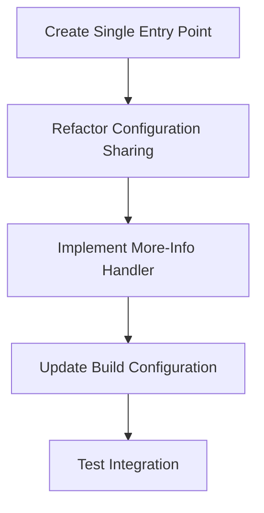
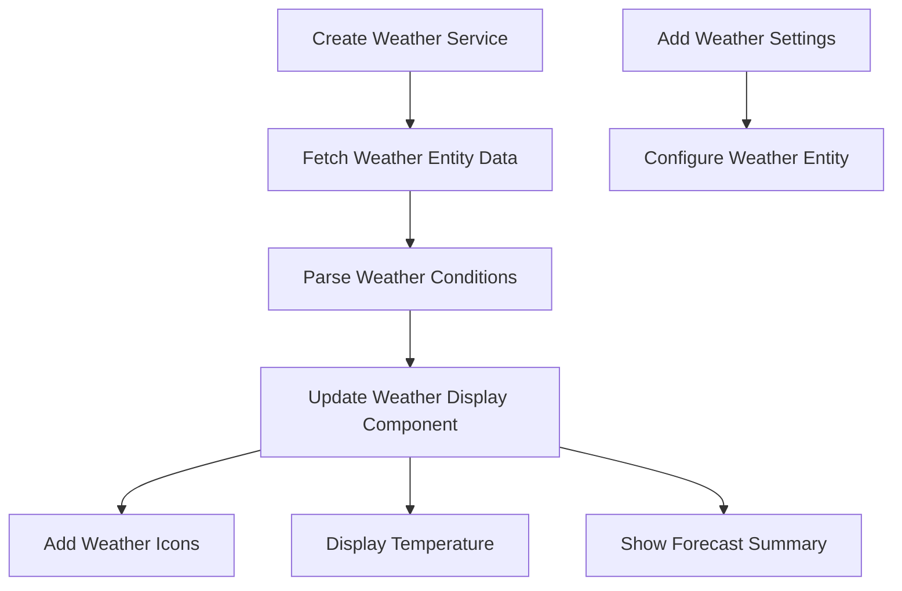
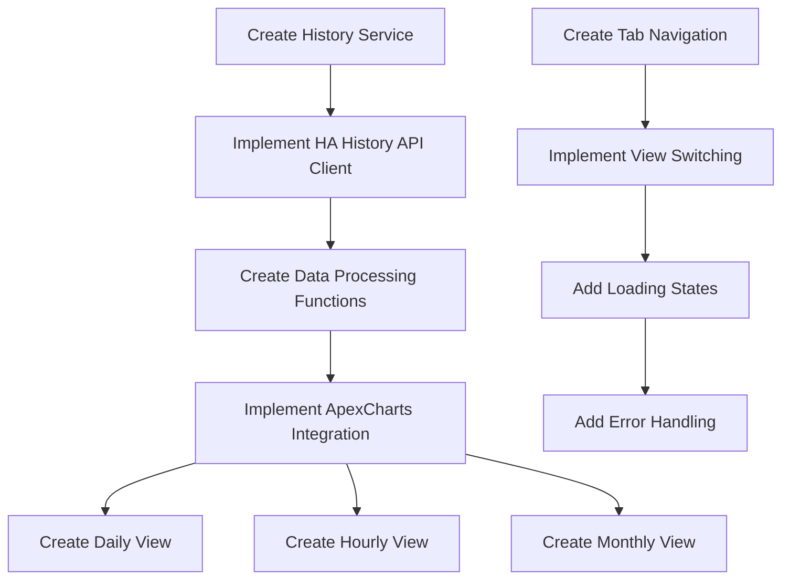
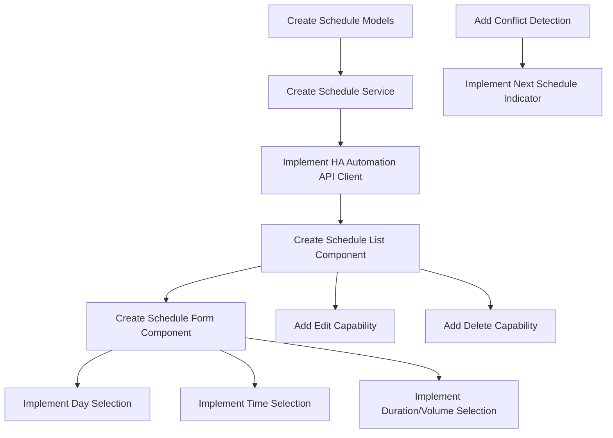
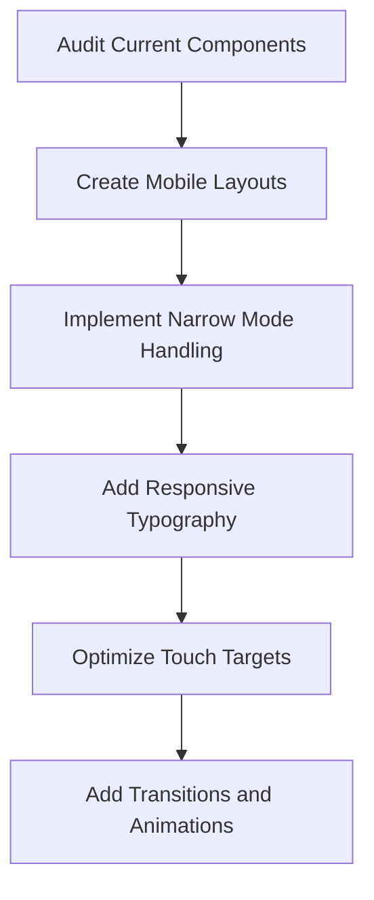
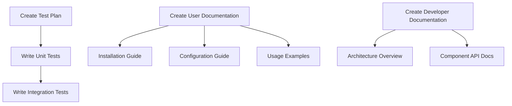
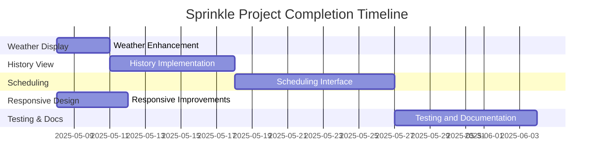

# Sprinkle Project Implementation Plan

This document outlines the detailed implementation plan for completing the remaining features of the Sprinkle project, a custom Lovelace card for Home Assistant that controls a Sonoff Zigbee smart-valve for irrigation.

## 0. Architecture Refactoring

| Task | Description | Complexity | Est. Time | Dependencies |
|------|-------------|------------|-----------|--------------|
| Create Single Entry Point | Create unified sprinkle.js file | Medium | 4 hours | None |
| Refactor Configuration Sharing | Update card to store and share config | Medium | 3 hours | Single Entry Point |
| Implement More-Info Handler | Register custom more-info handler | High | 5 hours | Configuration Sharing |
| Update Build Configuration | Modify webpack for single output | Low | 2 hours | None |
| Implement Dialog Cleanup | Ensure proper cleanup when dialogs close | Medium | 2 hours | More-Info Handler |
| Update Documentation | Update docs for simplified config | Low | 2 hours | All above tasks |

**Total Estimated Time: 18 hours**
**Timeline: 2-3 days**

This architectural refactoring will simplify the user experience by:
1. Eliminating duplicate configuration
2. Reducing the number of JavaScript files loaded
3. Simplifying maintenance
4. Improving state management between components

## 1. Weather Display Enhancement

| Task | Description | Complexity | Est. Time | Dependencies |
|------|-------------|------------|-----------|--------------|
| Create Weather Service | Implement service to interact with HA weather entities | Medium | 4 hours | None |
| Update Weather Display Component | Enhance component to show real weather data | Medium | 3 hours | Weather Service |
| Add Weather Icons | Implement dynamic weather icons based on conditions | Low | 2 hours | Weather Display Component |
| Add Forecast Summary | Show brief forecast information | Medium | 3 hours | Weather Service |
| Add Weather Configuration | Allow user to configure weather entity | Low | 2 hours | None |

**Total Estimated Time: 14 hours**
**Timeline: 2-3 days**

## 2. History View Implementation

| Task | Description | Complexity | Est. Time | Dependencies |
|------|-------------|------------|-----------|--------------|
| Create History Service | Service to fetch and process history data | High | 6 hours | None |
| Implement HA History API Client | Functions to query HA history API | Medium | 4 hours | History Service |
| Create Data Processing Functions | Process raw data for charts | High | 5 hours | HA History API Client |
| Add ApexCharts Integration | Integrate chart library | Medium | 4 hours | None |
| Implement Daily View | Chart showing daily water usage | Medium | 3 hours | ApexCharts, Data Processing |
| Implement Hourly View | Chart showing hourly water usage | Medium | 3 hours | ApexCharts, Data Processing |
| Implement Monthly View | Chart showing monthly water usage | Medium | 3 hours | ApexCharts, Data Processing |
| Create Tab Navigation | UI for switching between views | Low | 2 hours | None |
| Add Loading States | Show loading indicators during data fetch | Low | 2 hours | All chart views |
| Add Error Handling | Handle API errors gracefully | Medium | 3 hours | All chart views |

**Total Estimated Time: 35 hours**
**Timeline: 5-7 days**

## 3. Scheduling Interface

| Task | Description | Complexity | Est. Time | Dependencies |
|------|-------------|------------|-----------|--------------|
| Create Schedule Models | Define data models for schedules | Low | 2 hours | None |
| Create Schedule Service | Service to manage schedules | High | 6 hours | Schedule Models |
| Implement HA Automation API Client | Interface with HA automation API | High | 6 hours | Schedule Service |
| Create Schedule List Component | UI to display existing schedules | Medium | 4 hours | Schedule Service |
| Create Schedule Form Component | Form for creating/editing schedules | High | 6 hours | Schedule Service |
| Implement Day Selection | UI for selecting days of week | Medium | 3 hours | Schedule Form Component |
| Implement Time Selection | Time picker for schedule | Medium | 3 hours | Schedule Form Component |
| Implement Duration/Volume Selection | Reuse existing controls for schedules | Low | 2 hours | Schedule Form Component |
| Add Edit Capability | Allow editing existing schedules | Medium | 3 hours | Schedule List, Form Components |
| Add Delete Capability | Allow deleting schedules | Low | 2 hours | Schedule List Component |
| Add Conflict Detection | Detect and warn about overlapping schedules | Medium | 4 hours | Schedule Service |
| Implement Next Schedule Indicator | Show next scheduled watering | Medium | 3 hours | Schedule Service |

**Total Estimated Time: 44 hours**
**Timeline: 7-9 days**

## 4. Responsive Design Improvements

| Task | Description | Complexity | Est. Time | Dependencies |
|------|-------------|------------|-----------|--------------|
| Audit Current Components | Review all components for responsive issues | Medium | 4 hours | None |
| Create Mobile Layouts | Optimize layouts for small screens | Medium | 5 hours | Audit |
| Implement Narrow Mode Handling | Use HA's narrow property consistently | Medium | 4 hours | Mobile Layouts |
| Add Responsive Typography | Ensure text is readable on all devices | Low | 2 hours | None |
| Optimize Touch Targets | Ensure all interactive elements are properly sized | Low | 3 hours | Mobile Layouts |
| Add Transitions and Animations | Smooth transitions between states | Medium | 4 hours | All UI components |

**Total Estimated Time: 22 hours**
**Timeline: 3-4 days**

## 5. Testing and Documentation

| Task | Description | Complexity | Est. Time | Dependencies |
|------|-------------|------------|-----------|--------------|
| Create Test Plan | Define test strategy and coverage goals | Medium | 3 hours | None |
| Write Unit Tests | Tests for individual components | High | 8 hours | All components |
| Write Integration Tests | Tests for component interactions | High | 6 hours | All components |
| Create User Documentation | End-user documentation | Medium | 5 hours | All features |
| Create Installation Guide | Step-by-step installation instructions | Low | 2 hours | None |
| Create Configuration Guide | Document all configuration options | Medium | 3 hours | All features |
| Create Usage Examples | Example configurations and use cases | Medium | 4 hours | All features |
| Create Developer Documentation | Documentation for contributors | Medium | 5 hours | All code |
| Create Architecture Overview | Document system architecture | Medium | 3 hours | All code |
| Create Component API Docs | Document component APIs | Medium | 4 hours | All components |

**Total Estimated Time: 43 hours**
**Timeline: 6-8 days**

## Overall Timeline and Dependencies

### Implementation Order and Parallel Work

1. **First Phase (Days 1-4)**
   - Weather Display Enhancement (14 hours)
   - Begin Responsive Design Improvements (22 hours)

2. **Second Phase (Days 5-11)**
   - History View Implementation (35 hours)
   - Complete Responsive Design Improvements

3. **Third Phase (Days 12-20)**
   - Scheduling Interface (44 hours)

4. **Fourth Phase (Days 21-28)**
   - Testing and Documentation (43 hours)

### Total Project Completion
- **Total Estimated Hours: 158 hours**
- **Total Timeline: 28 days (4 weeks)**
- **Assuming 5-6 productive hours per day**

## Resource Allocation Recommendations

1. **Frontend Development**: 70% of effort
   - Focus on UI components and interactions
   - Chart implementation
   - Responsive design

2. **Integration Work**: 20% of effort
   - Home Assistant API integration
   - Data processing
   - Service layer

3. **Testing & Documentation**: 10% of effort
   - Unit and integration tests
   - User and developer documentation

## Risk Assessment

| Risk | Impact | Probability | Mitigation |
|------|--------|------------|------------|
| Home Assistant API changes | High | Low | Create abstraction layer for HA interactions |
| Chart library complexity | Medium | Medium | Start with simple charts, add features incrementally |
| Responsive design challenges | Medium | Medium | Test frequently on multiple device sizes |
| Schedule automation complexity | High | High | Research HA automation API thoroughly before implementation |

## Technical Considerations

### Weather Display
- Use Home Assistant's weather entity attributes for conditions, temperature, and forecasts
- Consider caching weather data to reduce API calls
- Implement appropriate error handling for missing weather entities

### History View
- Research Home Assistant's history API endpoints and authentication requirements
- Consider data aggregation strategies for efficient chart rendering
- Plan for handling large datasets with pagination or time-based filtering

### Scheduling Interface
- Research Home Assistant's automation API for creating and managing automations
- Design a clear and intuitive UI for schedule creation
- Implement validation to prevent invalid schedules

### Responsive Design
- Use CSS variables for consistent styling
- Implement media queries and flex/grid layouts for responsive behavior
- Test on various device sizes and orientations

### Testing
- Set up Jest for unit testing
- Consider using Storybook for component development and testing
- Implement mock services for testing components in isolation