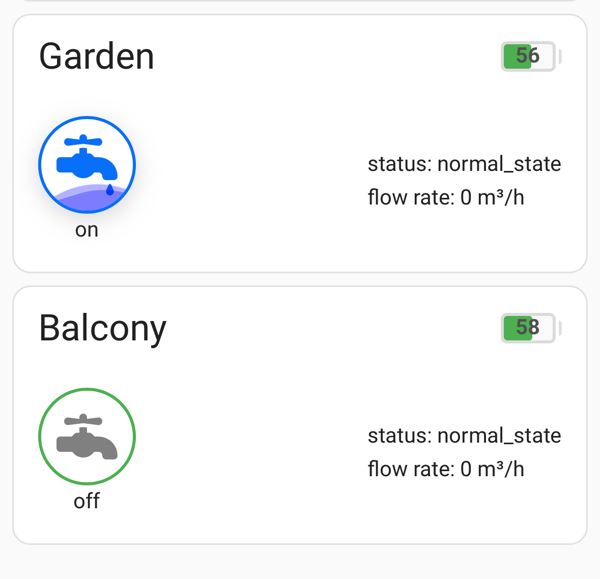
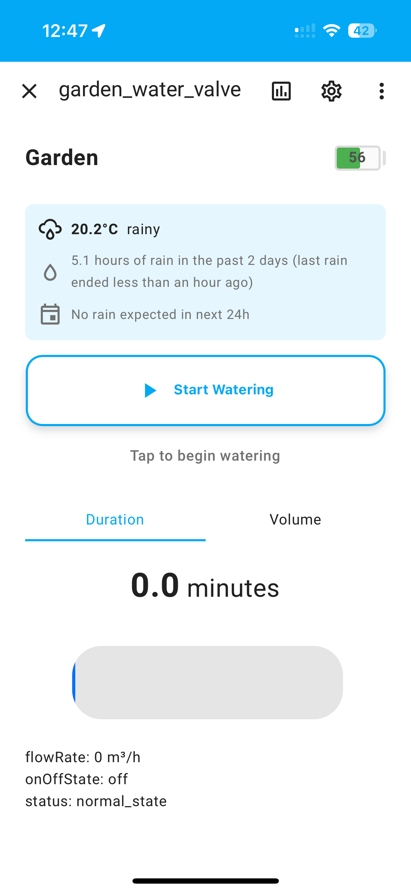
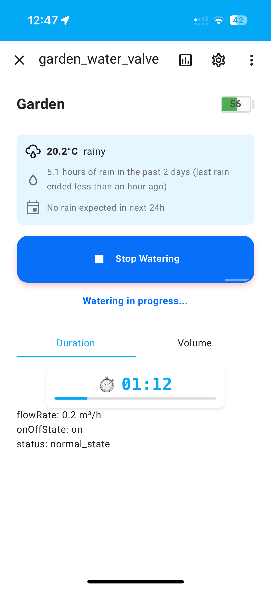

# Sprinkle - Custom Home Assistant Card for Smart Irrigation Control



## Overview
Sprinkle is a custom Lovelace card for Home Assistant that provides an intuitive interface to control Sonoff Zigbee smart water valves for irrigation. It integrates seamlessly with Home Assistant to provide both basic and advanced irrigation control features with weather integration.

> **Note:** Sprinkle is in active development and the API may change in future releases.

### Key Features
- **Compact Card View**: Shows valve state, battery level, status, and flow rate at a glance
- **Detailed More Info Dialog**: Full control interface with weather information and advanced options
- **Dual Control Modes**: 
  - Duration-based watering (minutes with countdown timer)
  - Volume-based watering (liters with precise control)
- **Weather Integration**: Displays current weather, recent rainfall, and forecast
- **Optimistic UI Updates**: Immediate feedback with graceful error handling
- **Zigbee Integration**: Full support for Sonoff Zigbee smart water valves
- **MQTT Support**: Advanced control via MQTT for Zigbee2MQTT integration
- **Battery Monitoring**: Real-time battery level tracking with visual indicators

### Compatibility
- **Home Assistant**: Version 2024.12.0 or newer
- **Supported Devices**: Sonoff Zigbee smart water valves (tested with TRVZB model)
- **Integrations**: Zigbee2MQTT, Weather entities (Met.no, OpenWeatherMap, etc.)
- **Browser**: Any modern browser with JavaScript enabled

## Prerequisites

Before installing Sprinkle, ensure you have the following set up:

- **Home Assistant** (version 2024.12.0 or newer)
- **Sonoff Zigbee smart water valve** configured in Home Assistant
- **Zigbee2MQTT integration** (for advanced features and entity discovery)
- **Weather integration** (optional but recommended for rain tracking)

## Installation

### Method 1: HACS Installation (Recommended)
1. Make sure [HACS](https://hacs.xyz/) is installed in your Home Assistant instance
2. Go to **HACS** → **Frontend**
3. Click the **"+ Explore & Download Repositories"** button
4. Search for **"Sprinkle"** and select it
5. Click **"Download"** to install the latest version
6. **Restart Home Assistant**
7. Hard refresh your browser (Ctrl+F5 or Cmd+Shift+R)

### Method 2: Manual Installation
1. Download the latest `sprinkle-card.js` file from the [releases page](https://github.com/AlexDubok/hass-custom-components/releases)
2. Create the following directory structure in your Home Assistant configuration:
   ```
   /config/www/community/sprinkle/
   ```
3. Copy `sprinkle-card.js` to `/config/www/community/sprinkle/sprinkle-card.js`
4. Add the resource to your Lovelace configuration:

   **Option A: Via UI (Recommended)**
   - Go to **Settings** → **Dashboards** → **Resources** tab
   - Click **"+ Add Resource"**
   - Set URL to `/hacsfiles/sprinkle/sprinkle-card.js` (HACS) or `/local/community/sprinkle/sprinkle-card.js` (manual)
   - Set Resource type to **"JavaScript Module"**
   - Click **"Create"**

   **Option B: Via YAML**
   ```yaml
   # In your lovelace configuration
   resources:
     - url: /local/community/sprinkle/sprinkle-card.js
       type: module
   ```

5. **Restart Home Assistant**
6. **Clear browser cache** and refresh the page

### Verification
After installation:
1. Go to your Lovelace dashboard
2. Click **"Edit Dashboard"**
3. Click **"+ Add Card"**
4. Scroll down to find **"Custom: Sprinkle Card"** in the list
5. If the card doesn't appear, check:
   - Resource URL is correct
   - Browser cache is cleared
   - Home Assistant was restarted after adding the resource

## Configuration

### Basic Configuration
Add the following minimal configuration to your Lovelace dashboard:

```yaml
type: custom:sprinkle-card
title: Garden Irrigation
device_name: garden_water_valve
valve_entity: switch.garden_water_valve
```

### Complete Configuration Example

Here's a full configuration example with all available options:

```yaml
type: custom:sprinkle-card
title: Garden
device_name: garden_water_valve
valve_entity: switch.garden_water_valve
battery_entity: sensor.garden_water_valve_battery
flow_entity: sensor.garden_water_valve_flow
device_status_entity: sensor.garden_water_valve_current_device_status
auto_close_entity: switch.garden_water_valve_auto_close_when_water_shortage
timed_irrigation_entity: sensor.garden_water_valve_cyclic_timed_irrigation
quantitative_irrigation_entity: sensor.garden_water_valve_cyclic_quantitative_irrigation
volume_max: 25
duration_max: 15
weather_entity: weather.home
```

### Configuration Options

| Option | Type | Required | Default | Description |
|--------|------|----------|---------|-------------|
| `type` | string | **Yes** | - | Must be `custom:sprinkle-card` |
| `title` | string | No | - | Card title displayed at the top |
| `device_name` | string | **Yes** | - | Device name as configured in Zigbee2MQTT |
| `valve_entity` | string | **Yes** | - | Entity ID of the valve switch (e.g., `switch.garden_water_valve`) |
| `battery_entity` | string | No | - | Entity ID for battery level sensor |
| `flow_entity` | string | No | - | Entity ID for flow rate sensor (m³/h) |
| `device_status_entity` | string | No | - | Entity ID for device status sensor |
| `auto_close_entity` | string | No | - | Entity ID for auto-close when water shortage feature |
| `timed_irrigation_entity` | string | No | - | Entity ID for duration-based irrigation sensor |
| `quantitative_irrigation_entity` | string | No | - | Entity ID for volume-based irrigation sensor |
| `volume_max` | number | No | 50 | Maximum volume in liters (1-100) |
| `duration_max` | number | No | 30 | Maximum duration in minutes (1-60) |
| `weather_entity` | string | No | - | Entity ID for weather information display |

### Multiple Valve Setup

For multiple irrigation zones, create separate cards:

```yaml
# Garden valve
type: custom:sprinkle-card
title: Garden
device_name: garden_water_valve
valve_entity: switch.garden_water_valve
battery_entity: sensor.garden_water_valve_battery
weather_entity: weather.home

# Balcony valve  
type: custom:sprinkle-card
title: Balcony
device_name: balcony_water_valve
valve_entity: switch.balcony_water_valve
battery_entity: sensor.balcony_water_valve_battery
weather_entity: weather.home
```

### Finding the Right Entities

To find the correct entity IDs for your configuration:

1. Go to **Developer Tools** → **States** in your Home Assistant dashboard
2. Filter by your device name (e.g., "smart_water_valve")
3. Note the entity IDs for each required sensor or switch
4. Use these entity IDs in your Sprinkle card configuration

## Usage Guide

### Adding the Card to Your Dashboard

1. **Edit your Lovelace dashboard** by clicking the edit button (pencil icon)
2. **Click the "+ Add Card"** button
3. **Scroll down** and select **"Custom: Sprinkle Card"**
4. **Enter your configuration** (see Configuration section above)
5. **Click "Save"** to add the card to your dashboard

### Card Interface

#### Compact Card View

The compact card shows essential information at a glance:


**Information displayed:**
- **Title**: Your configured card title (e.g., "Garden", "Balcony")
- **Valve Icon**: Visual state indicator (blue when on, gray when off)
- **Battery Level**: Green indicator showing current charge percentage
- **Device Status**: Current operational state (e.g., "normal_state")
- **Flow Rate**: Current water flow in m³/h (shown when water is flowing)

**Quick Actions:**
- **Tap the valve icon**: Instantly toggle the valve on/off
- **Tap anywhere else**: Open the detailed More Info dialog

#### More Info Dialog

The detailed dialog provides full control and weather integration:

 

**Features:**
- **Weather Panel**: Shows current conditions, recent rainfall, and forecast
- **Battery Indicator**: Prominent battery level display in top-right
- **Control Button**: Large "Start Watering" or "Stop Watering" button
- **Mode Tabs**: Switch between "Duration" and "Volume" control modes
- **Smart Slider**: Adjust watering time or volume with live preview
- **Status Information**: Real-time flow rate and device status
- **Countdown Timer**: Live countdown when watering is active (shown in second image)

### Control Modes

#### Duration Mode (Time-based Watering)
Perfect for scheduled irrigation sessions:

1. **Tap your card** to open the More Info dialog
2. **Select "Duration" tab** (usually selected by default)
3. **Use the slider** to set watering time (1-60 minutes)
4. **View the preview**: Shows "X.X minutes" below the slider
5. **Tap "Start Watering"** to begin timed irrigation
6. **Monitor progress**: Watch the live countdown timer and flow rate

#### Volume Mode (Quantity-based Watering)
Ideal for precise water delivery:

1. **Open the More Info dialog**
2. **Select "Volume" tab**
3. **Adjust the slider** to set desired water amount (1-100 liters)
4. **Confirm the amount**: Displayed below the slider
5. **Start watering**: The valve will automatically close when the target volume is reached

### Smart Features

#### Weather Integration
When a weather entity is configured, Sprinkle displays:
- **Current conditions**: Temperature and weather state
- **Rainfall tracking**: Hours of rain in the past 2 days
- **Smart suggestions**: "No rain expected in next 24h" helps with watering decisions

#### Optimistic UI
- **Instant feedback**: UI updates immediately when you tap controls
- **Error handling**: Gracefully handles connection issues
- **Status sync**: Automatically syncs with actual device state

#### Battery Management
- **Visual indicators**: Green battery icon with percentage
- **Low battery alerts**: Visual warnings when battery is low
- **Trend monitoring**: Track battery usage over time

## Troubleshooting

### Common Issues

#### Card Not Appearing in Dashboard Editor
**Problem**: "Custom: Sprinkle Card" doesn't show up when adding cards.

**Solutions**:
1. **Verify resource is loaded**:
   - Go to **Settings** → **Dashboards** → **Resources**
   - Check that Sprinkle resource is listed and URL is correct
2. **Clear browser cache**: Press Ctrl+F5 (Windows) or Cmd+Shift+R (Mac)
3. **Check console errors**: Open browser dev tools (F12) and look for JavaScript errors
4. **Restart Home Assistant** and refresh the page

#### Entities Not Found or Showing "Unknown"
**Problem**: Card shows "Unknown" for battery, flow rate, or other sensors.

**Solutions**:
1. **Check entity names**: Go to **Developer Tools** → **States** and verify exact entity IDs
2. **Wait for Zigbee2MQTT**: New devices may take time to expose all entities
3. **Check Zigbee2MQTT logs**: Look for device communication issues
4. **Verify device configuration**: Ensure valve is properly paired and configured

#### Weather Information Not Displaying
**Problem**: Weather panel is empty or not showing.

**Solutions**:
1. **Configure weather entity**: Add `weather_entity: weather.your_weather_provider` to card config
2. **Check weather integration**: Ensure you have a working weather integration (Met.no, OpenWeatherMap, etc.)
3. **Verify entity state**: Check that weather entity is active in **Developer Tools** → **States**

#### Valve Not Responding to Commands
**Problem**: Clicking buttons doesn't control the valve.

**Solutions**:
1. **Test manual control**: Try controlling valve from **Developer Tools** → **Services**
2. **Check Zigbee signal**: Ensure valve is within range of Zigbee coordinator
3. **Battery level**: Low battery can cause communication issues
4. **MQTT connection**: Verify Zigbee2MQTT is connected and operational
5. **Entity permissions**: Check that the switch entity supports turn_on/turn_off services

#### Slider Controls Not Working
**Problem**: Duration/volume sliders don't respond or don't update values.

**Solutions**:
1. **Check entity configuration**: Ensure timed/quantitative irrigation entities are correctly configured
2. **MQTT topics**: Verify Zigbee2MQTT exposes the required device capabilities
3. **Device compatibility**: Some valve models may not support all advanced features

### Device Setup Guide

#### Setting Up Your Sonoff Zigbee Valve

1. **Pair with Zigbee2MQTT**:
   ```bash
   # Enable pairing mode in Zigbee2MQTT
   # Press and hold the valve's button for 5+ seconds until LED blinks
   ```

2. **Verify entities in Home Assistant**:
   After successful pairing, you should see entities like:
   ```
   switch.your_valve_name                              # Main valve control
   sensor.your_valve_name_battery                      # Battery level
   sensor.your_valve_name_flow                         # Flow rate
   sensor.your_valve_name_current_device_status        # Device status
   # Additional entities may appear depending on valve model
   ```

3. **Test basic functionality**:
   - Toggle valve on/off from **Developer Tools** → **Services**
   - Verify battery level updates
   - Check flow rate during water flow

#### Zigbee2MQTT Configuration

Add this to your Zigbee2MQTT `configuration.yaml` for optimal performance:

```yaml
# Enable advanced features for irrigation devices
advanced:
  legacy_api: false
  log_syslog: {}
device_options:
  friendly_name: garden_water_valve
  retain: false
```

### Performance Optimization

#### Reducing Resource Usage
- **Limit polling frequency**: Use reasonable update intervals for sensors
- **Disable unused entities**: Hide entities you don't need in Home Assistant
- **Optimize weather updates**: Use local weather integration when possible

#### Network Considerations
- **Zigbee range**: Ensure valve is within good signal range
- **MQTT broker**: Use reliable MQTT broker (internal HA broker recommended)
- **WiFi stability**: Ensure stable network connection for real-time updates

### Debug Information

If you need to report issues, include:

1. **Home Assistant version**
2. **Sprinkle card version** 
3. **Browser and version**
4. **Zigbee2MQTT version** (if applicable)
5. **Device model** (exact Sonoff valve model)
6. **Console errors** from browser dev tools
7. **Card configuration** (sanitized)

## Advanced Configuration

### Custom CSS Styling

You can customize the card appearance using CSS:

```yaml
# Add to your theme or card-mod configuration
sprinkle-card:
  --sprinkle-primary-color: #1976d2
  --sprinkle-battery-good-color: #4caf50
  --sprinkle-battery-warning-color: #ff9800
  --sprinkle-battery-critical-color: #f44336
```

### Automation Integration

Integrate Sprinkle with Home Assistant automations:

```yaml
# Example: Water garden every morning if no rain
automation:
  - alias: "Morning Garden Watering"
    trigger:
      platform: time
      at: "06:00:00"
    condition:
      - condition: numeric_state
        entity_id: sensor.garden_water_valve_battery
        above: 20
      - condition: state
        entity_id: weather.home
        state: ['sunny', 'cloudy']
    action:
      - service: switch.turn_on
        target:
          entity_id: switch.garden_water_valve
```

## Contributing

We welcome contributions! Please see the [contributing guidelines](CONTRIBUTING.md) for details on:

- Reporting bugs
- Suggesting features  
- Submitting pull requests
- Development setup

## Changelog

### Version 1.0.0 (Latest)
- ✅ Initial release with basic valve control
- ✅ Duration and volume-based watering modes
- ✅ Weather integration with Met.no support
- ✅ Battery monitoring and status display
- ✅ Optimistic UI with error handling
- ✅ Zigbee2MQTT integration

### Planned Features
- 📅 Historical usage charts and statistics
- 📅 Advanced scheduling interface
- 📅 Multiple weather provider support
- 📅 Customizable themes and layouts

## License

This project is licensed under the MIT License - see the [LICENSE](LICENSE) file for details.

## Support

- 🐛 **Bug Reports**: [GitHub Issues](https://github.com/AlexDubok/hass-custom-components/issues)
- 💬 **Community**: [Home Assistant Community Forum](https://community.home-assistant.io/)

---

**Made with ❤️ for the Home Assistant community**