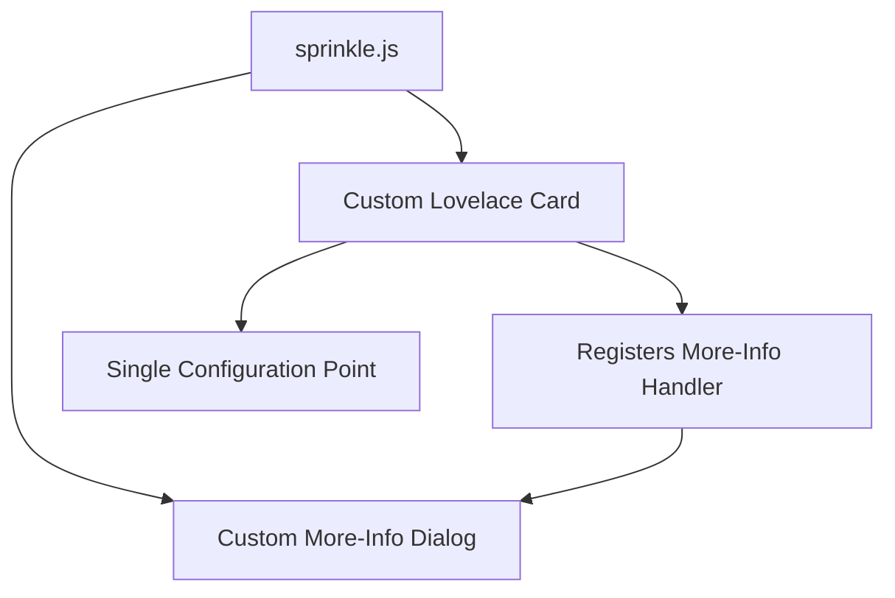

# Sprinkle - Smart Irrigation Card for Home Assistant

## 1. Project Overview

**Sprinkle** is a custom Lovelace card for Home Assistant (HA) that provides an intuitive interface to control a **Sonoff Zigbee smart-valve** used for irrigation. The implementation features both a **compact card view** for dashboards and a detailed **More Info dialog** for advanced controls. The project is built with LitElement/Lit 3.x and TypeScript, following Home Assistant's development patterns.

## 2. Current Implementation Status

| Feature | Status | Notes |
|---------|--------|-------|
| Compact Card View | ✅ Implemented | Shows valve state, battery, status, flow rate |
| More Info Dialog | ✅ Implemented | Full control interface with tabs for duration/volume |
| Valve Control | ✅ Implemented | Toggle on/off with optimistic updates |
| Duration-based Watering | ✅ Implemented | Configurable duration slider (minutes) |
| Volume-based Watering | ✅ Implemented | Configurable volume slider (liters) |
| Battery Display | ✅ Implemented | Shows battery percentage |
| Weather Display | 🟡 Partial | Basic placeholder implemented |
| History View | 🟡 Partial | Component structure created, chart implementation pending |
| Scheduling | ❌ Planned | Not yet implemented |

## 3. UI Components

### 3.1 Compact Card View

The compact card view (`sprinkle-status-card`) provides at-a-glance information and basic control:

| Element | Implementation Details |
|---------|------------------------|
| **Valve icon** | SVG icon with animation when active. Changes appearance based on state. |
| **Battery** | Shows numeric percentage. |
| **Device status** | Displays device status text from entity. |
| **Flow rate** | Shows flow rate with unit of measurement when available. |

**Actions:**
* Tap on icon: Toggles valve state with optimistic UI updates
* Tap on rest of card: Opens the More Info dialog

### 3.2 More Info Dialog

The More Info dialog (`sprinkle-more-info`) provides detailed control and information:

| Section | Implementation Details |
|---------|------------------------|
| Header | Weather display (currently a placeholder) and battery percentage |
| Main Control | Large "Start Watering"/"Stop Watering" button with status text |
| Mode Selection | Tabs to switch between Duration and Volume modes |
| Slider Control | Interactive slider for setting duration (minutes) or volume (liters) |
| Value Display | Shows current value with units (minutes/liters) |
| Debug Info | Currently shows detailed state information (will be replaced with history) |

## 4. Technical Implementation

### 4.1 Architecture

The project follows a component-based architecture with clear separation of concerns:

* **Components**: UI elements (card-mini, watering-controls, watering-slider)
* **Containers**: Component coordinators (watering-container)
* **Services**: Business logic (valve-service, ha-service)
* **Types**: TypeScript interfaces and types
* **Utils**: Helper functions

### 4.2 Key Services

* **ValveService**: Handles valve operations including:
  * Basic on/off control
  * Timed watering (duration-based)
  * Volume-based watering
  * Reading valve state, battery level, and flow rate

* **HomeAssistantService**: Abstracts Home Assistant API interactions:
  * Entity state retrieval
  * Service calls

### 4.3 Unified Architecture

The project will be refactored to use a unified architecture with a single entry point:



**Key architectural improvements:**
1. **Single Entry Point** - One JavaScript file that exports both components
2. **Configuration Sharing** - Configuration stored in card and passed to dialog
3. **More-Info Registration** - Custom handler for more-info dialog integration
4. **Simplified User Experience** - Single configuration point

### 4.4 Configuration Options

The card supports the following configuration options (single configuration point):

```yaml
type: custom:sprinkle-card
title: Balcony irrigation
device_name: garden_water_valve
valve_entity: switch.garden_water_valve
battery_entity: sensor.garden_water_valve_battery
flow_entity: sensor.garden_water_valve_flow
device_status_entity: sensor.garden_water_valve_current_device_status
auto_close_entity: switch.garden_water_valve_auto_close_when_water_shortage
timed_irrigation_entity: sensor.garden_water_valve_cyclic_timed_irrigation
quantitative_irrigation_entity: sensor.garden_water_valve_cyclic_quantitative_irrigation
volume_max: 25  # Maximum volume in liters
duration_max: 30 # Maximum duration in minutes
```

### 4.5 Communication Protocol

The implementation uses MQTT for advanced valve control features:
* Basic on/off uses Home Assistant's standard switch services
* Duration and volume-based watering use MQTT messages to the Zigbee2MQTT integration

## 5. Tech Stack

* **Language**: TypeScript (ES 2022)
* **Framework**: Lit 3.x (same as Home Assistant)
* **Build Tools**: Webpack
* **Testing**: Jest for unit tests
* **Styling**: CSS with Lit's static styles

## 6. Pending Features

1. **History View**: Complete implementation of watering history visualization
   * Chart integration with ApexCharts.js
   * Data fetching from Home Assistant history API
   * Daily/weekly/monthly views

2. **Weather Integration**: Enhanced weather display with actual data from weather entities
   * Current conditions
   * Forecast integration

3. **Scheduling**: UI for creating and managing watering schedules
   * Day/time selection
   * Duration/volume configuration
   * Schedule management

## 7. Project Structure

The project is organized as follows:

```
packages/sprinkle/
├── src/
│   ├── components/       # UI components
│   ├── containers/       # Component coordinators
│   ├── services/         # Business logic
│   ├── types/            # TypeScript types
│   ├── utils/            # Helper functions
│   ├── card.ts           # Main card entry point
│   └── sprinkle-more-info.ts  # More info dialog
├── tests/                # Test files
└── ...                   # Configuration files
```

## 8. Acceptance Criteria

* Card loads with zero console errors in HA ≥ 2024.12
* All props reactive within 200ms of state change
* Optimistic UI reverts on failure within timeout period
* Slider emits correct events and restores state on reopen
* Configuration options properly applied
* Tests pass in CI (GitHub Actions)
